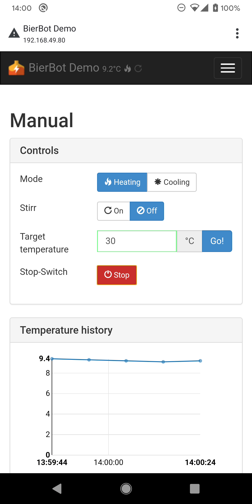
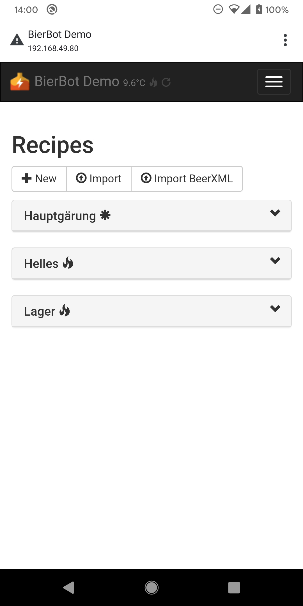
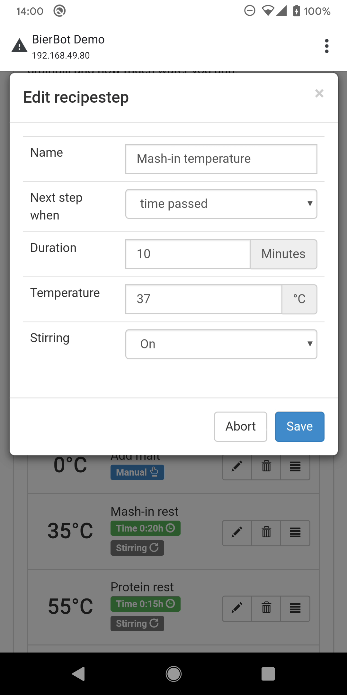
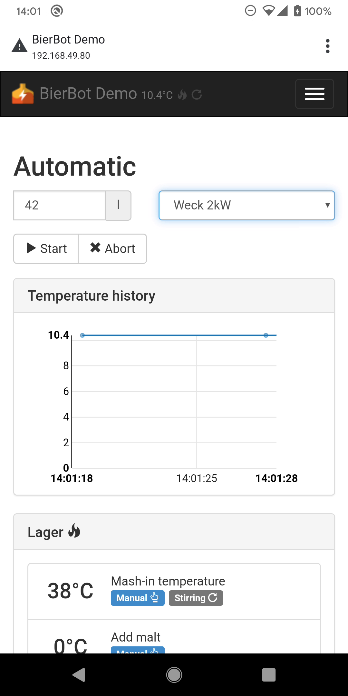
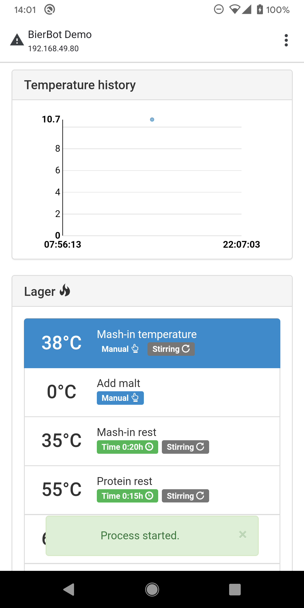
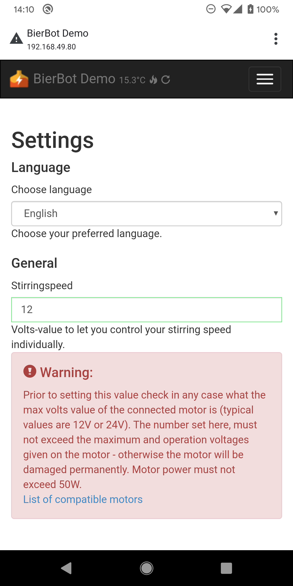
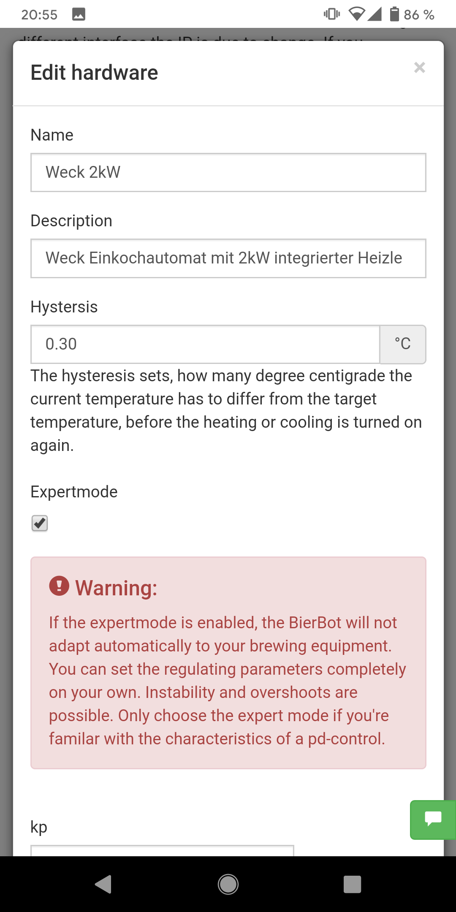
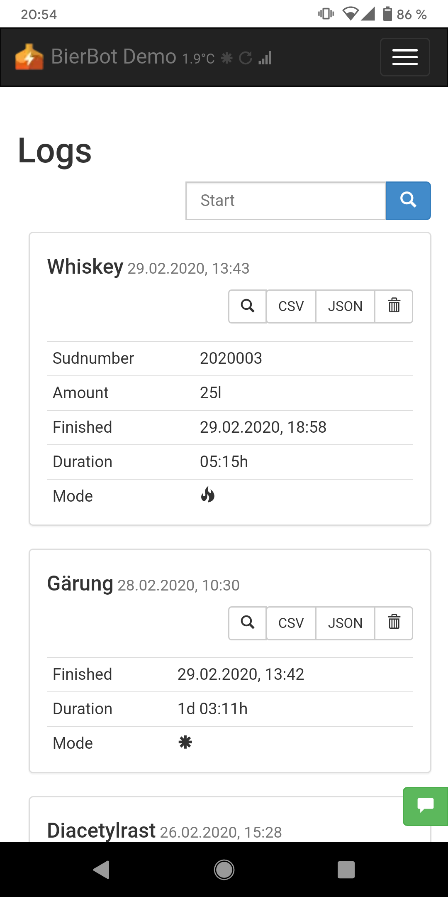
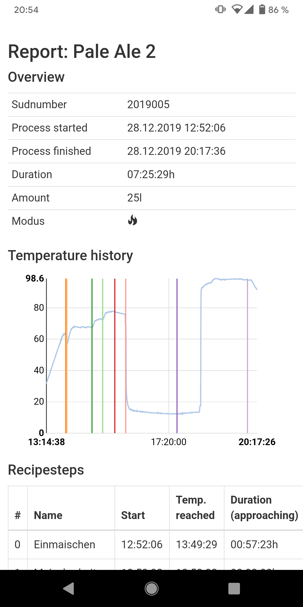
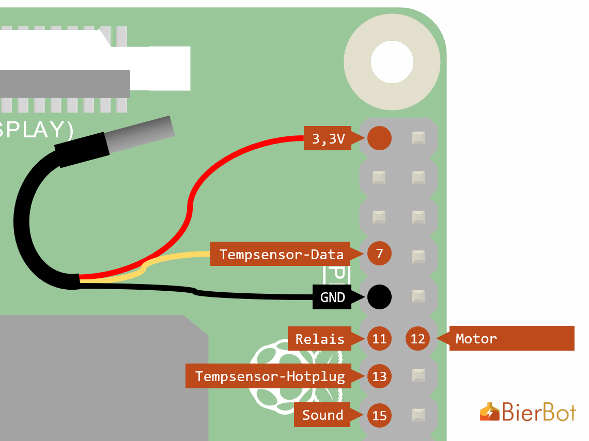

<p align="center">
   
   <h1 align="center"> Raspberry Pi powered Brewing Software</h1>
</p>

This README is also available in [German ](./doc/README_DE.MD)

## Key features

-   Runs on Raspberry Pi ([compatible Pis](#compatibility))
-   Free, do-the-fuck-you-want Open Source license (MIT)
-   Easy to setup (one liner)
-   Simple: one sensor, one relay
-   PD controller that works with a simple and cheap non PWM/SSR relay and yet eliminates temperature overshoots
-   Modes for mashing and fermentation
-   Multi-language (German, English, pull-requests welcome)
-   Integrated recipes: Set the temperature, the time, etc.
-   Integrated logging: See your temperature log during the mash and export a PDF after brewing
-   User authentication
-   Can send messages to Telegram during brewing
-   Works perfectly on any web browser

## Updates

- v.2.1.0 (23.01.2021)
   - Added telegram Bot support, thanks to [@jonathanschneider](https://github.com/jonathanschneider) for the PR
   - Bugfix BeerXML import now working (again), tested with recipes from [www.brewersfriend](https://www.brewersfriend.com/)

## Screenshots

<p float="left">
   
   
   
   
   
   
   
   
   
</p>

## Software-Installation

### Prepare SD-Card and Raspberry Pi

1.  Download RASPBIAN BUSTER LITE from the [official website](https://www.raspberrypi.org/downloads/raspbian/).
    Recommended version is from February 2020 (Release Date 2020-02-13), with kernel version 4.19.
1.  Flash it to the SD card as described on the [setup page](https://www.raspberrypi.org/documentation/installation/installing-images/)
1.  Connect at least an (micro) HDMI cable (monitor), USB keyboard and microUSB
    (USB-C) for power to your Raspberry Pi (4). Wait for it to boot twice.
1.  Login using user `pi` and password `raspberry`
1.  Run (=type) `sudo raspi-config`,
    1.  select `5 Interfacing Options` > `P2 SSH` and confirm with `<yes>`
    1.  _Optional_: If you want to connect to your WiFi: now is your time:
        select `2 Network options` > `N2 Wifi`. This is also possible via the
        BierBot Software later.
    1.  Also _optional_ but **recommended**: `1 Change user password`.
1.  You may now unplug your HDMI and keyboard and operate the Raspberry Pi soley over Ethernet / WiFi.
1.  Connect to your router to figure out the IP of your Raspberry Pi.

### Install the BierBot software

Now, we are ready to update the Raspberry Pi and install all requirements, such as NodeJS and the database which is the promised **one-liner**.

```bash
cd ~ && wget https://raw.githubusercontent.com/BernhardSchlegel/BierBot/master/bierbot-setup.sh && chmod +x bierbot-setup.sh && sudo ./bierbot-setup.sh
```

**Congrats**, you're done. Your BierBot is now accessible at http://BierBotBen (you can change the name of your BierBot on the configuration page)

If you want to know what the script does in the background, check out the (potentially outdated) explanation [here](/doc/SETUP_MANUAL.MD).


## Compatibility

The BierBot install script and Software has been tested on the following
Raspberry Pis ([source](https://de.wikipedia.org/wiki/Raspberry_Pi)):

<table>
   <thead>
      <tr>
         <th>Raspberry Pi</th>
         <th colspan=4>1</th>
         <th colspan=2>2</th>
         <th colspan=3>3</th>
         <th colspan=1>4</th>
      </tr>
         <tr>
            <th>Type</th>
            <th>A</th>
            <th>A+</th>
            <th>B</th>
            <th>B+</th>
            <th>B</th>
            <th>B v1.2</th>
            <th>A+</th>
            <th>B v.1.2</th>
            <th>B+</th>
            <th>B</th>
         </tr>
   </thead>
   <tbody>
      <tr>
         <td>ARM</td>
         <td align="center" colspan=4>ARMv6 (32 Bit)</td>
         <td>ARMv7 (32Bit)</td>
         <td align="center"colspan=5>ARMv8 (64 Bit)</td>
      </tr>
      <tr>
         <td>Power to beep</td>
         <td></td>
         <td></td>
         <td></td>
         <td></td>
         <td></td>
         <td>1m 31s</td>
         <td></td>
         <td>1m 36s</td>
         <td></td>
         <td>1m 33s</td>
      </tr>
      <tr align="center">
         <td>setupscript</td>
         <td></td>
         <td></td>
         <td></td>
         <td></td>
         <td></td>
         <td>:heavy_check_mark:</td>
         <td></td>
         <td>:heavy_check_mark:</td>
         <td></td>
         <td>:heavy_check_mark:</td>
      </tr>
      <tr align="center">
         <td>software</td>
         <td></td>
         <td></td>
         <td></td>
         <td></td>
         <td></td>
         <td>:heavy_check_mark:</td>
         <td></td>
         <td>:heavy_check_mark:</td>
         <td></td>
         <td>:heavy_check_mark:</td>
      </tr>
   </tbody>
</table>

**TL;DR**: Get the cheapest one, in terms of startup speed: No difference.

If you happen to own one of the models with a blank cell, shoot me a message!

## Hardware-Setup

The default BierBot wiring is as follows (I'll use the `RPi# (pigpio#)` syntax):



-   The [DS18B20](https://amzn.to/2TQrvxQ) sensor is connected to 3,3V, GND, and
    Pin Number RPi 7 (pi-gpio 7). With the latter being the data-channel of your sensor.
-   The control channel of your Relais is connected to 11 (17). This will be used
    to turn on/off your heating / cooling device.
-   Your motor (for stirring your mash) is connected to Pin 12 (18). This is a PWM
    Pin - which will be used. You can set your Motor Voltage on the BierBot
    settings page.
-   Pin 13 (27) is _optional_: If you want your temperature sensor to be hot pluggable
    connect this pin. It will trigger an ISR on either edge (falling / rising) and
    is pulled via an internal resistor to ground.
-   Pin 15 (22) is also _optional_: If you connect a [piezzo buzzer](https://amzn.to/2vDWe9D) the BierBot tells you with a beeping symphony when the next step is
    reached or the brew is finished.  

## TODOS

-   migrate client package management from `bower` to `yarn`.

## Contributing

If you want to contribute, your Pull-Request or translation is very welcome!
Please see the [notes for developers](/doc/CONTRIBUTING.MD) to get you started!

## License

-   My Code: [MIT](http://opensource.org/licenses/MIT)
-   Orange Mash BierBot Logo: (c) by Bernhard Schlegel, all rights reserved.

Copyright (c) 2014-present, Bernhard Schlegel
