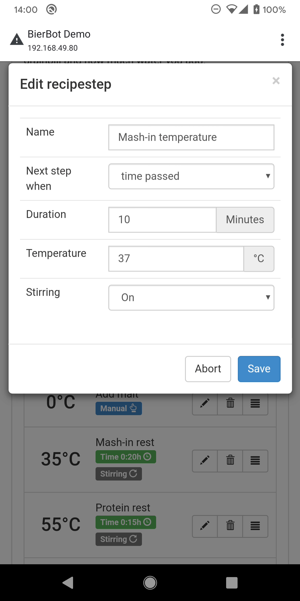
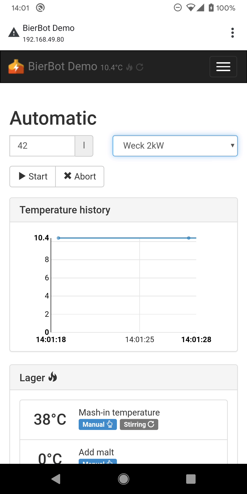
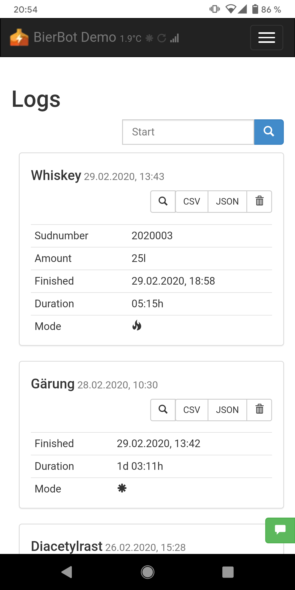
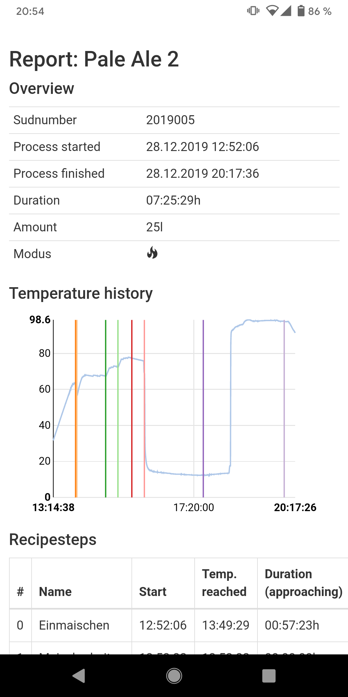

<p align="center">
   
   <h1 align="center">Brau-Software für den Raspberry Pi</h1>
</p>

This README is also available in [English ](../README.MD)

## Funktionen

-   Läuft auf dem RaspberryPi (getestet auf RPi4)
-   Komplett freie, Open Source Lizenz (MIT).
-   Einfache Installation (Einzeiler).
-   Simpel: Ein Sensor, ein Relais.
-   PD-Controller der auch mit einfachen, günstigen Standard-Relais funktioniert
    und dennoch effektiv das Überschiessen der Temperatur vermeidet.
-   Modi für Maischen und Gärung.
-   Multilingual (Deutsch, Englisch, Pull-Requests für weitere Sprachen sind
    willkommen).
-   Integrierte Rezeptverwaltung: Rastdauer, -temperatur und Rührwerkskonfiguration.
-   Integriertes Logging: Der Temperaturverlauf wird während dem Brauen angezeigt,
    nach dem Brauvorgang gibt's einen Braubericht.
-   Passwortschutz (beta).
-   Läuft auf jedem iPhone, Android, Windows, Mac, Ubuntu und Raspberry Pi.

## Screenshots

<p float="left">
   
   
   
   
   
   
   
   
   
</p>

## Software-Installation

### Prepare SD-Card and Raspberry Pi

1.  Download RASPBIAN BUSTER LITE von der [offiziellen Website](https://www.raspberrypi.org/downloads/raspbian/). Die empfohlene Version ist vom
    Februar 2020 (Release Datum 2002-02-13), mit kernel version 4.19.
2.  Image auf die SD-Karte flashen gemäß [dieser Seite](https://www.raspberrypi.org/documentation/installation/installing-images/)
3.  Anschließen des (micro) HDMI Kabels (Monitor), USB-Keyboards and microUSBs
    (USB-C) für Strom an den RaspberryPi (4). Warten bis er zwei mal gebootet hat.
4.  Login mit User `pi` und Passwort `raspberry` (:warning: US-Keyboard, y-z
    sind getauscht).
5.  Ausführen (=tippen) `sudo raspi-config`,
    1.  Dann `5 Interfacing Options` > `P2 SSH` und mit `<yes>` bestätigen.
    2.  `5 Interfacing Options` > `P7 1-Wire` > `<yes>`
    3.  _Optional_: Falls ihr direkt WLAN verbinden wollt: Jetzt ist die Zeit:
        Wählt `2 Network options` > `N2 Wifi`. Das wird aber auch später über
        die Oberfläche des BierBots gehen.
    4.  Ebenfalls _optional_ aber **empfohlen**: `1 Change user password`.
6.  Jetzt kannst du den Monitor abstöpseln - der Rest läuft über SSH, also
    einen anderen PC - macht das einfügen des Links (s.u.) leichter.
7.  Verbinde dich mit deiner Router-Oberfläche um die IP des Raspberies
    rauszufinden.

### Installieren der BierBot software

Jetzt kannst du die BierBot Software installieren. Hier, wie versprochen, der
(etwas lange :wink: ) **Einzeiler**:

```bash
cd ~ && wget https://raw.githubusercontent.com/BernhardSchlegel/BierBot/master/bierbot-setup.sh && chmod +x bierbot-setup.sh && sudo ./bierbot-setup.sh
```

**Glückwunsch**, das wars.

## Hardware-Setup

Standardmäßig muss der BierBot wie folgt verkabel werden (ich werde mich an denied `RPi# (pigpio#)` Syntax halten):


- Der [DS18B20](https://amzn.to/2TQrvxQ) sensor muss mit 3,3V, GND und Pin
  Nummer RPi 7 (pi-gpio 7) verbunden werden. Das ist der Datenkanal des
  Temperatur-Sensors.
- Der Daten-Pin deines Relais muss mit Pin 11 (17) verbunden werden. Damit wird
  deine Heizung / Kühlung an- bzw. ausgeschaltet.
- Deinen Motor (z.B. um die Maische zu rühren) muss mit Pin 12 (18) verbunden
  werden. Das ist ein PWM-Pin - was auch benutzt werden wird. Die Motorspannung
  (und damit die Drehgeschwindigkeit) kannst du in der BierBot-Oberfläche
  (Einstellungen) setzen.
- Pin 13 (27) is *optional*: Wenn der Temperatursensor nach dem Sart des
  BierBots ein- und ausgesteckt werden können soll, musst du diesen Pin verbinden.
  So wird eine ISR getriggert, die auf beiden Flanken (steigend und fallend) nach
  neuen Temperatur sensoren sucht. Intern ist dieser Pin mit einem
  Pulldown-Widerstand auf ground gezogen.
- Pin 15 (22) ist ebenfalls *optional*: Hier kannst du einen [piezzo buzzer](https://amzn.to/2vDWe9D) anschließen. Der BierBot signalisiert dann mit einer
  Pieps-Symphonie, wenn der nächste Schritt erreicht wird, oder der Brauvorgang
  beendet ist.

## Mitachen!

Wenn du bei der Entwicklung des BierBots helfen möchtest, freue ich mich über
jeden Pull-Request oder Übersetzung. Für Entwickler gibt's eine extra Seite mit
wichtigen Infos: [Infos für Entwickler](/doc/CONTRIBUTING.MD)!

## Lizenz

- Mein Code: [MIT](http://opensource.org/licenses/MIT).
- Das oragene Maischpfannen-Logo: (c) by Bernhard Schlegel, all rights reserved.

Copyright (c) 2014-present, Bernhard Schlegel
